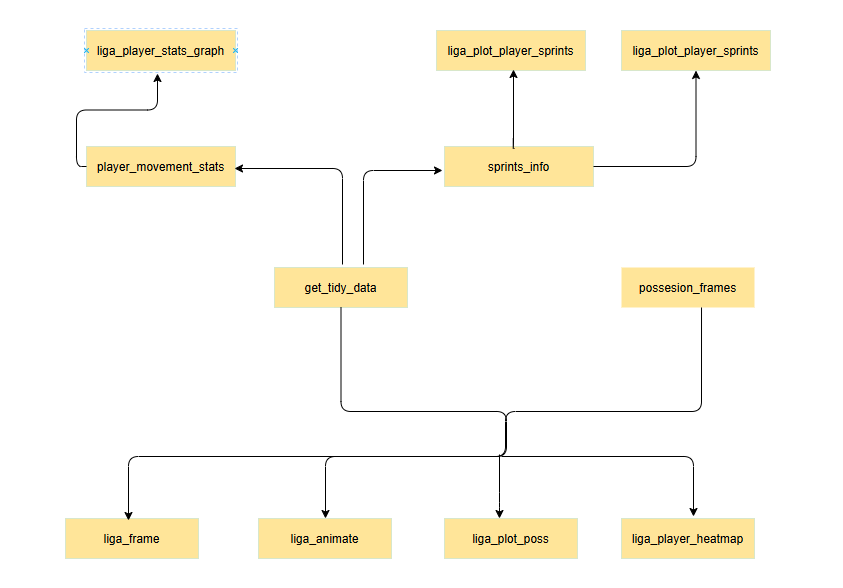
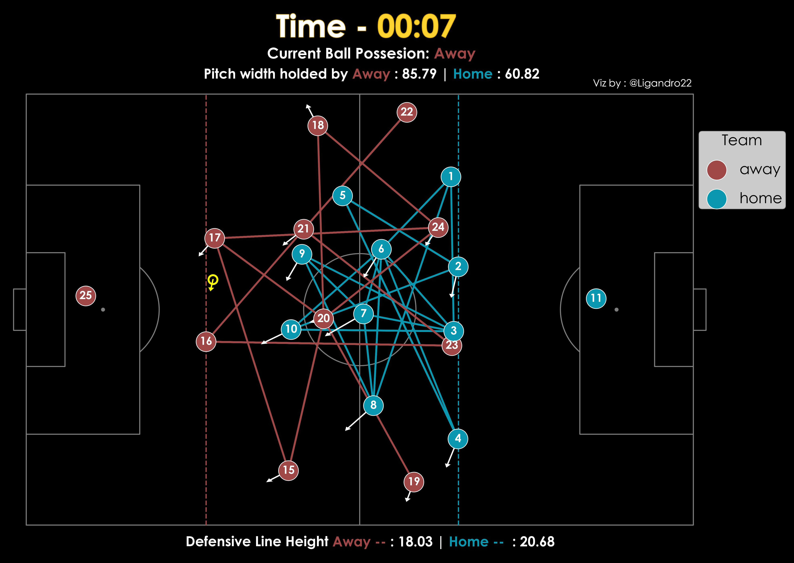
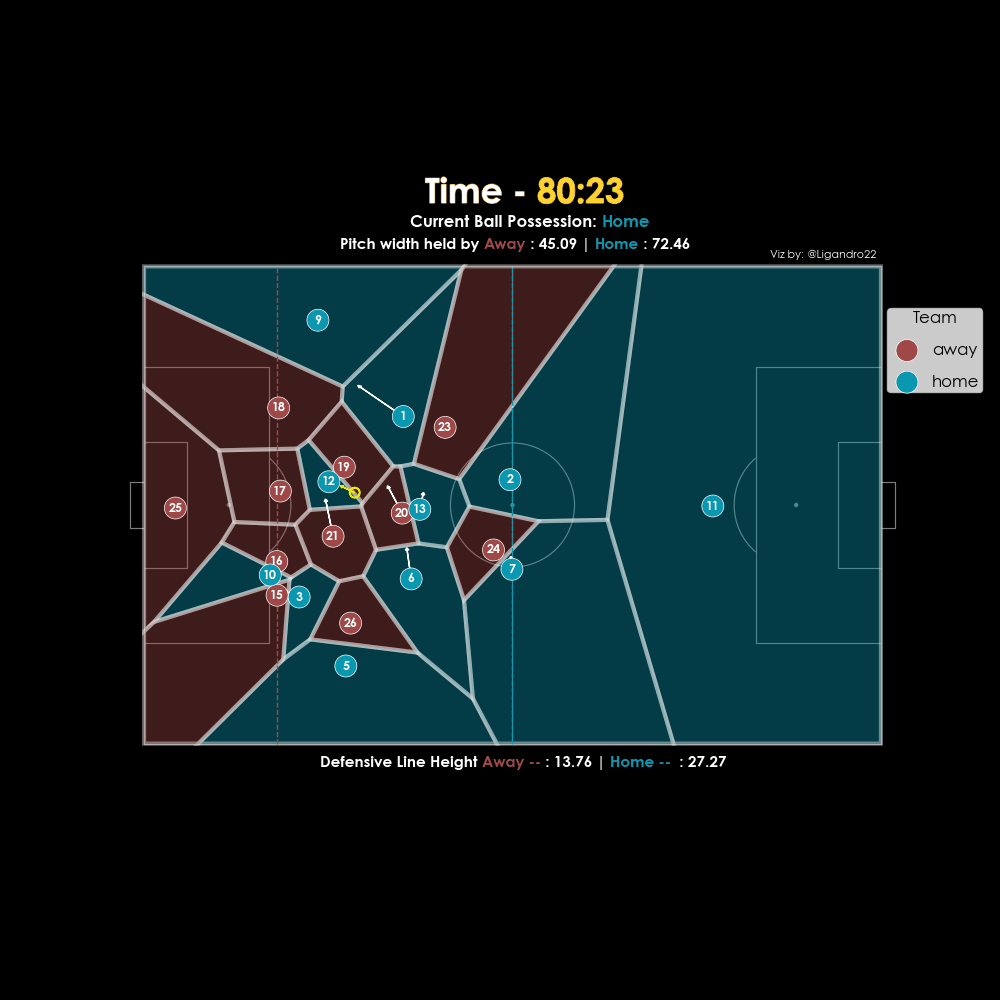
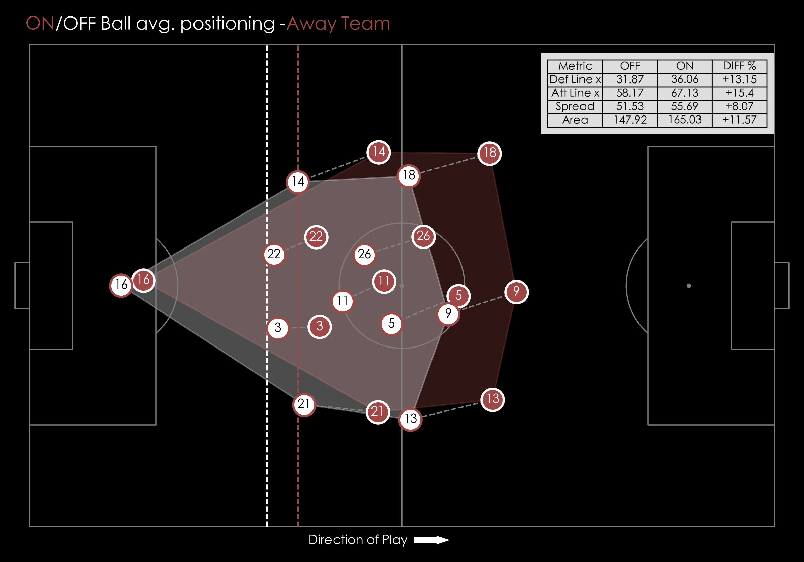
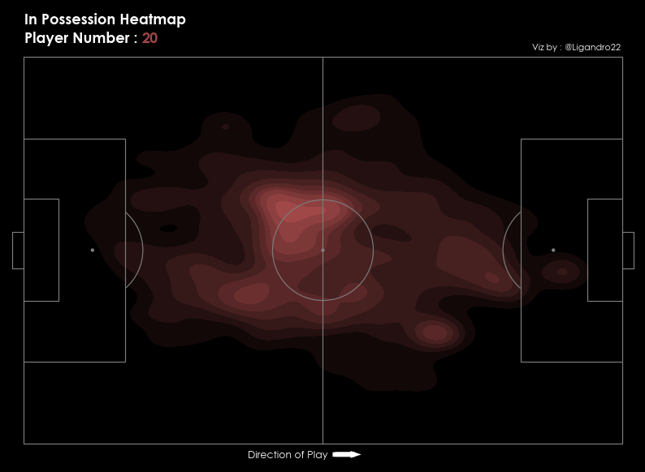
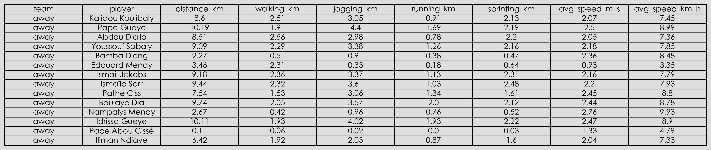
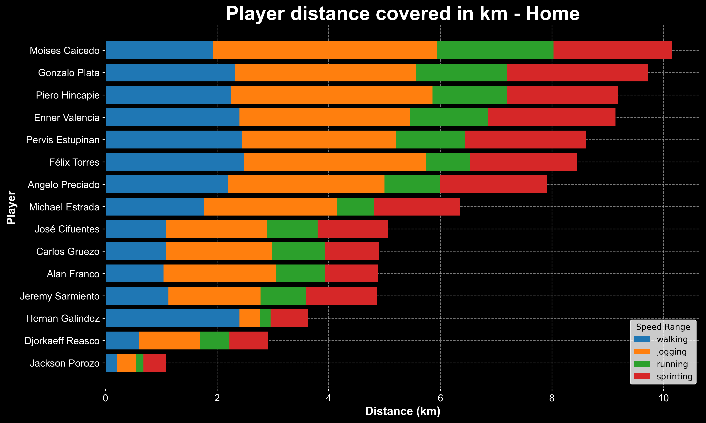
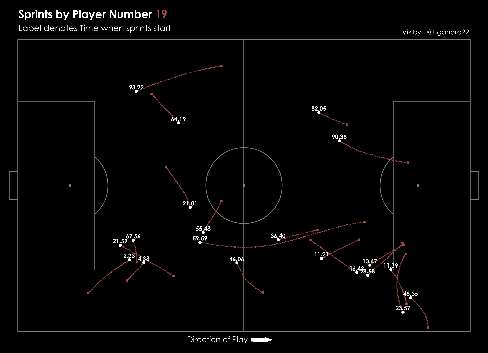
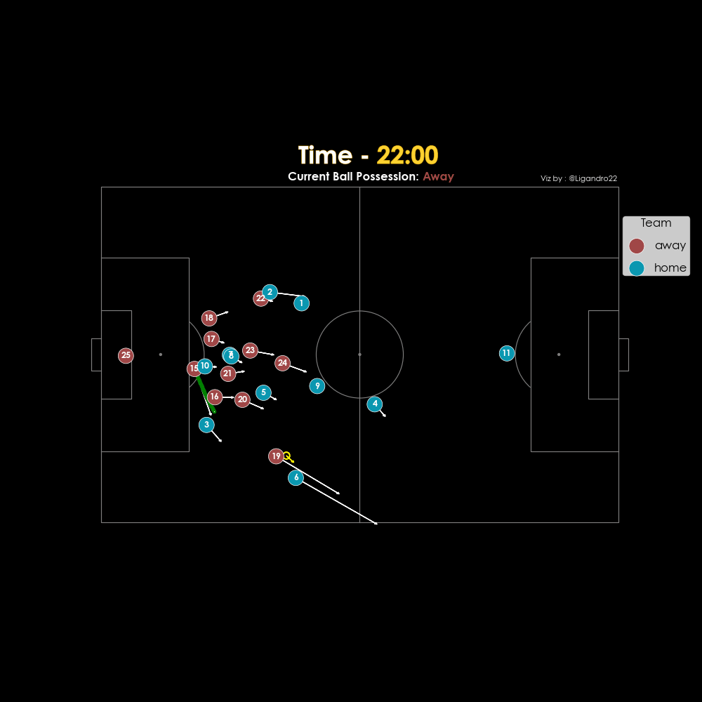

# ligafooty


*A Python package for football tracking visualization and analytics.*

## 📌 Overview
ligafooty is a Python package designed for **football tracking data visualization**, **player movement analysis**, and calculating **possession-based statistics**. It provides easy-to-use functions for plotting football pitch events, animations, and team performance insights. It is a direct twin copy of the  [@socceranimate](https://github.com/Dato-Futbol/soccerAnimate) library from Dato-Futbol which is written in R. This one has some additional features such as defensive line, team possesion status etc. [@mplsoccer](https://mplsoccer.readthedocs.io/en/latest/index.html) library is used for pitch visualisation.

## Data Source
Currently only data from the provider Metrica Sports is supported. Download from this [@link](https://github.com/metrica-sports/sample-data)

## Package functions structure
<p align="center">
   &nbsp &nbsp
</p>

## Use
You can directly run the demo.ipynb jupyter notebook after package installation

## 🔥 Features
- ✅ **Player tracking & movement analysis**
- ✅ **Ball possession detection**
- ✅ **Animations of player positions**
- ✅ **Convex hull, Voronoi, and Delaunay triangulation visualizations**
- ✅ **Customizable pitch themes & team colors**

## 📦 Installation
Install ligafooty from pypi:

```sh
pip install ligafooty
```
Directly from github
```sh
pip install git+https://github.com/ligandro/ligafooty.git
```

## 🚀 Getting Started
### Import ligafooty

```python
import ligafooty
```

### 1. Acquiring and Processing the tracking data

```python
from ligafooty.liga import get_tidy_data

home_team_file = r"Sample_Game_2_RawTrackingData_Home_Team.csv"
away_team_file = r"Sample_Game_2_RawTrackingData_Away_Team.csv"
tidy_data = get_tidy_data(home_team_file, away_team_file ,provider="Metrica", add_velocity=True, pitch_long=100, pitch_width=100)

```

### 2. Get Possesion Data from Event Data
```python
from ligafooty.liga import possesion_frames
import pandas as pd

ed =pd.read_csv(r"Sample_Game_2_RawEventsData.csv")

home_poss = possesion_frames(ed,"Home")
away_poss = possesion_frames(ed,"Away")
poss_data = pd.concat([home_poss, away_poss]) # Combine home and away possesion frames
```

### 3. 2D static plot for a single frame

```python
from ligafooty.liga import liga_frame

# methods availabele : base,convexhull,voronoi,delaunay
liga_frame(tidy_data,330,poss_data,method="voronoi",save=False) # Saved as frame_xyz.png in images folder
```
<p align="center">
   &nbsp &nbsp
</p>

### 4. 2D animation for a range of frames

```python
from ligafooty.liga import liga_animate

frame_start =120990
frame_end =121060

# On avg it takes 1 second to process 2-3 frames. So keep in mind to process 50-100 at once. 25 frames make up 1 second of video
# methods availabele : base,convexhull,voronoi,delaunay
liga_animate(tidy_data,poss_data,frame_start,frame_end,mode='voronoi',video_writer="gif",save=True) # Saved as animation.gif in videos folder
```


### 5. Team avg. positioning and stats by ON/OFF ball possession states

```python
from ligafooty.liga import liga_plot_poss

liga_plot_poss(tidy_data, poss_data, target_team ="away",save=True) # saved as team_possession.png in images folder
```
<p align="center">
   &nbsp &nbsp
</p>

### 6. Player heatmap by ON/OFF ball possession states

```python
from ligafooty.liga import liga_player_heatmap

# Make sure player no is in targt_team. Players from 1-14 are home and 15-28 are away
# Tales around 3 mins to run as it plots for each frame. Avg of 50k frames per player for both on/off
liga_player_heatmap(tidy_data,poss_data, target_team="away", target_player=20)
```
<p align="center">
   &nbsp &nbsp
</p>

<p align="center">
   &nbsp &nbsp
</p>

### 7.Player movement stats calculation and visualization

```python
from ligafooty.liga import player_movement_stats

player_stats = player_movement_stats(tidy_data, save= True)
```
<p align="center">
   &nbsp &nbsp
</p>


```python
from ligafooty.liga import liga_player_stats_graph

liga_player_stats_graph(player_stats,team="home",save = True)  # Saved as {team}_player_speed_graph.png in images folder
```

<p align="center">
   &nbsp &nbsp
</p>

### 8. Player Sprints Info and Vizualization

```python
from ligafooty.liga import sprints_info

target_team= "away"

player_sprints,sprints_data = sprints_info(tidy_data,target_team)
```

```python
from ligafooty.liga import liga_plot_player_sprints

liga_plot_player_sprints(tidy_data,sprints_data,target_team,target_player=19,save=True) # Saved as player_{number}_sprints.png in images folder
```

<p align="center">
   &nbsp &nbsp
</p>

### 9.Player animation highlighting a particular sprint

```python
from ligafooty.liga import liga_sprint_animate


target_player = 15
player_df = sprints_data[sprints_data["player"] == target_player]
sprint_frames = [[player_df.iloc[i]["n"], player_df.iloc[i + 1]["n"]] for i in range(0, len(player_df), 2)]

# Sprint Number
sprint_no = 6
sprint_frame = sprint_frames[sprint_no]

frame_start = sprint_frame[0]
frame_end =sprint_frame[1]

# Saved as {target_player}_sprint_animation.gif in videos folder
liga_sprint_animate(tidy_data,poss_data,target_player,frame_start,frame_end)
```

## 🛠 Dependencies
ligafooty requires the following packages:

```sh
pip install numpy pandas matplotlib mplsoccer highlight_text scipy pillow
```

## 🛠 Coming Soon
Other data sources


## 🤝 Contributing
Personal project currently. Limited data availibility so no use of this project for real world analysis as of now. Will try to ingest other data sources and then maybe contributions maye be possible.

## 📄 License
This project is licensed under the MIT License. 

## 🌟 Support & Contact
For any questions or feature requests, feel free to reach out:

📧 Linkedin : [@Linkedin](https://www.linkedin.com/in/ligandro-yumnam-631277218/)
🐦 Twitter: [@Ligandro22](https://twitter.com/Ligandro22)

