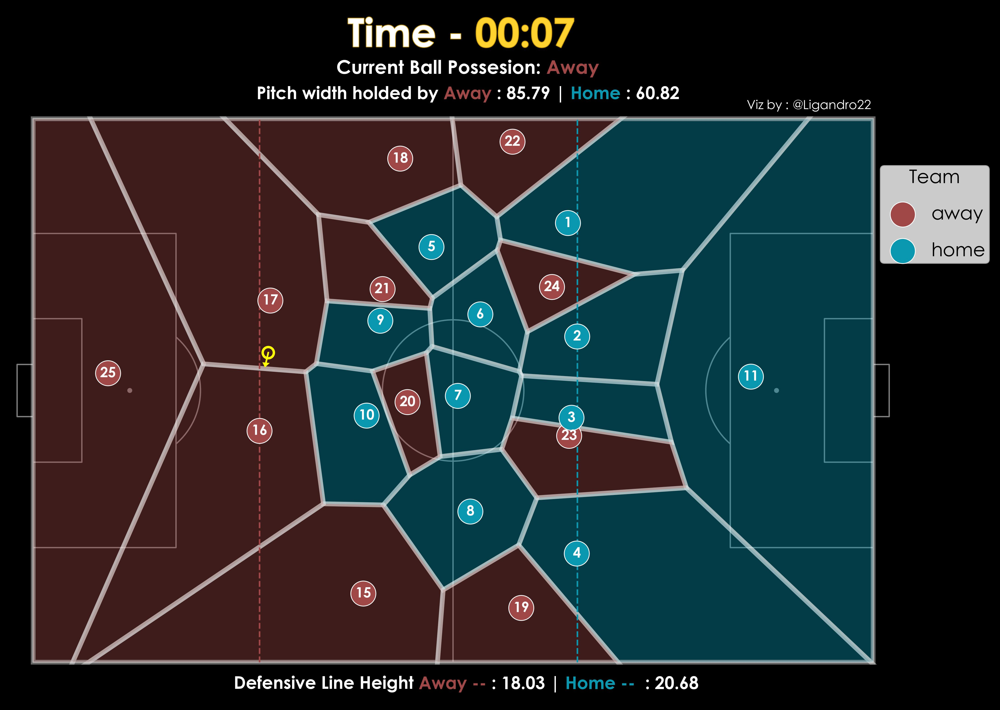
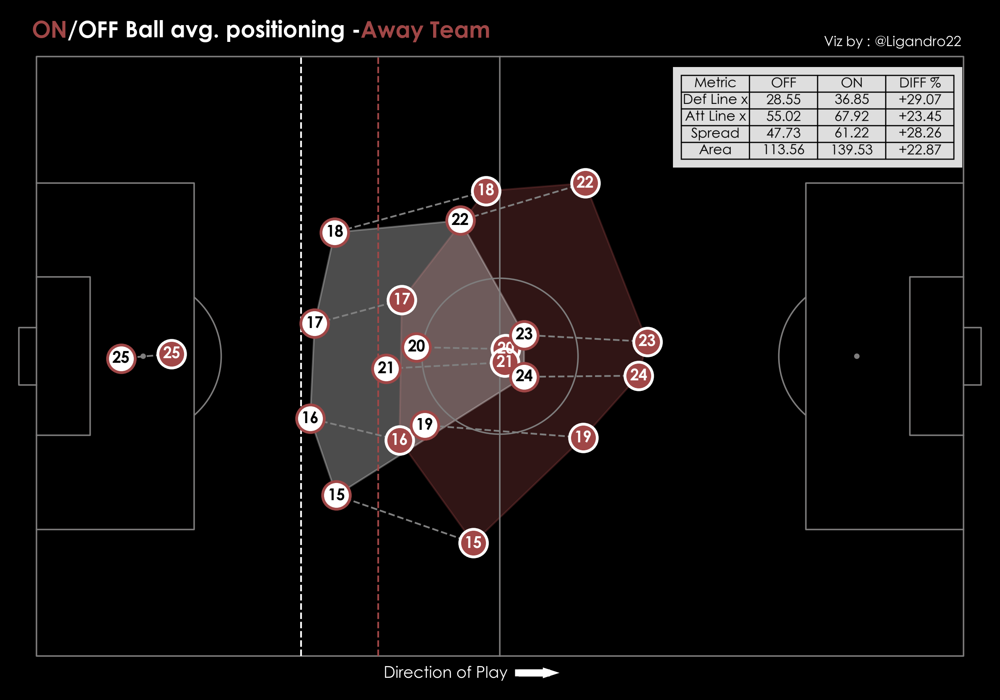
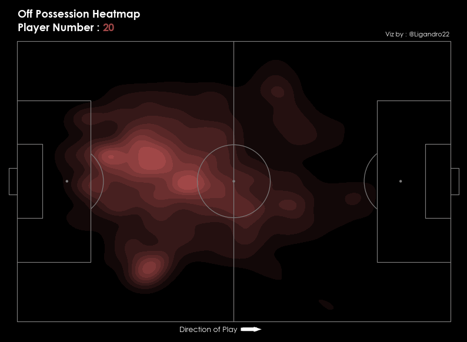
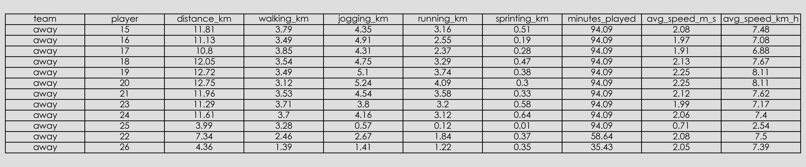
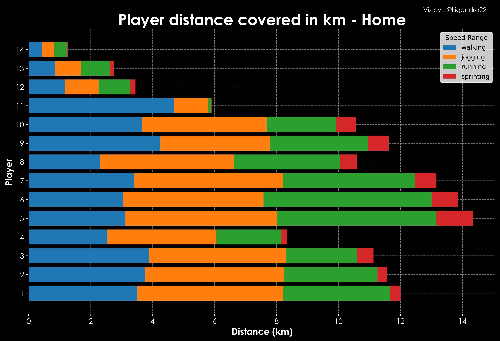

# ligafooty


*A Python package for football tracking visualization and analytics.*

## 📌 Overview
ligafooty is a Python package designed for **football tracking data visualization**, **player movement analysis**, and calculating **possession-based statistics**. It provides easy-to-use functions for plotting football pitch events, animations, and team performance insights. It is a direct twin copy of the  [@socceranimate](https://github.com/Dato-Futbol/soccerAnimate) library from Data-Futbal which is written in R. This one has some additional features such as defensive line, team possesion status etc. [@mplsoccer](https://mplsoccer.readthedocs.io/en/latest/index.html) library is used for pitch visualisation.

## 🔄 What's New in v0.3 ( 03/05/2025)

- 📦 Packaged with tracking data support using `kloppy`
- 📈 Added support for plotting and analyzing PFF Data
- 🧹 Improved structure for easier import and use
- 🐛 Fixed minor bugs from internal testing

## Data Source
Currently data from the provider Metrica Sports and PFF is supported. 

Get Metrica Data from this [@link](https://github.com/metrica-sports/sample-data)

Get PFF Data from this [@link](https://www.blog.fc.pff.com/blog/pff-fc-release-2022-world-cup-data)

## Use
You can directly run the demo_.ipynb jupyter notebook after package installation

## 🔥 Features
- ✅ **Player tracking & movement analysis**
- ✅ **Ball possession detection**
- ✅ **Animations of player positions**
- ✅ **Convex hull, Voronoi, and Delaunay triangulation visualizations**
- ✅ **Customizable pitch themes & team colors**

## 📦 Installation
Install ligafooty from pypi:

```sh
pip install ligafooty
```
Directly from github
```sh
pip install git+https://github.com/ligandro/ligafooty.git
```

## 🚀 Results

### 2D static plot for a single frame

<p align="center">
   &nbsp &nbsp
</p>

###  2D animation for a range of frames


### Team avg. positioning and stats by ON/OFF ball possession states

<p align="center">
   &nbsp &nbsp
</p>

### Player heatmap by ON/OFF ball possession states

<p align="center">
   &nbsp &nbsp
</p>

<p align="center">
   &nbsp &nbsp
</p>

### Player movement stats calculation and visualization

<p align="center">
   &nbsp &nbsp
</p>


<p align="center">
   &nbsp &nbsp
</p>

### Player Sprints Info and Vizualization ( Supported for Metrica Data )


<p align="center">
   &nbsp &nbsp
</p>

### Player animation highlighting a particular sprint ( Supported for Metrica Data )


## Note 
- Home team always attacks from right to left while Away from left to right
- Default pitch Opta 100 by 100
- To save as video you need to have ffpmeg writer on your system
- There will be multiple frames without ball in play. Theres only about 35-40% of frames where the ball is in play

## 🛠 Dependencies
ligafooty requires the following packages:

```sh
pip install numpy pandas matplotlib mplsoccer highlight_text scipy pillow kloppy
```

## 🛠 Coming Soon
Other data sources


## 🤝 Contributing
Personal project currently. Limited data availibility so no use of this project for real world analysis as of now. Will try to ingest other data sources and then maybe contributions may be possible.

## 📄 License
This project is licensed under the MIT License. 

## 🌟 Support & Contact
For any questions or feature requests, feel free to reach out:

📧 Linkedin : [@Linkedin](https://www.linkedin.com/in/ligandro-yumnam-631277218/)
🐦 Twitter: [@Ligandro22](https://twitter.com/Ligandro22)

